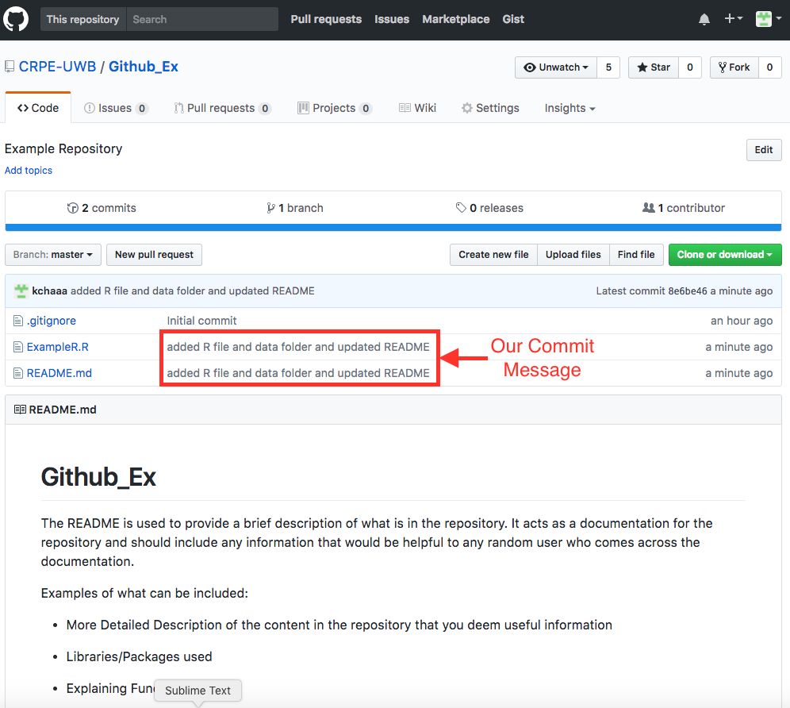

```{r, echo=FALSE}
# Set Up
# to access the images
setwd("/Users/crpe/Documents/GithubGuide") # MAC
```

# Introduction to Github and Git
### Github
[Github](https://github.com) is the website that we will use as our central hub/remote repository to store and share all of our code. To use Github, make sure to [create an account](https://github.com/join?source=header-home) unless you already have one.

Github has allows users to: 

* Store and back up code

* Send and share the code to different computers

* Track changes made

* Collaborate with other users. 

CRPE currently has a [Github Organization](https://github.com/CRPE-UWB) set up that contains all of our repositories. To obtain access, ask anyone who is an **owner** to add you. 

### Git 
*Git* is a programming language that incorporates new terminal commands used for version control and Github. *Git* commands will be introduced along the way.

**Note:** Whenever I write in *Command Line/Git*, the line that starts with "$" is the input, and the line with ">" is the output. Quotes/`""` around an output means that the output is a description of what will actually happen even if it isn't shown on the Terminal.

Example:
```
$ input line of code
> expected output from the line of code 
(or at least an example of what it should like with no error)
```
<br><br>

### Set Up

#### For Command Line

On MAC, use the program **Terminal** (should already be installed by default) or download another program that can interact with Command Line.

On PC, use the program **Command Prompt** (should already be installed by default) or download another program that can interact with Command Line.

I recommend PC Users to use Git's Git Bash.

#### For Markdown

You can use any text editor to write in Markdown and any programming languages actually.

MAC's default text editor is TextEdit. PC's default text editor is Notepad.

I personally have had a better experience using other free text editors like [Notepad++](https://notepad-plus-plus.org/) (PC only), [Atom](https://atom.io/), and [Sublime Text](https://www.sublimetext.com/). Sublime Text has a free trial version that provides all the functions you need that never expires.

#### For Git

In order to use *Git*, please download it [here](https://git-scm.com/). When you download *Git*, you are given the option to download Git Bash as well. You don't need to worry about downloading *Command Line*.

# Introduction to Command Line and Markdown
While you can use Github's [website](https://github.com/) to make changes to and/or download from repositories, it is not recommended. This is the same idea behind using R to change a data set instead of manually doing it oursevles in Excel. On that note, we will be using *Command Line* and *Git* to make changes to a respoistory. 

### Command Line Commands

*Command Line* is used to provide instructions to the computer. Here is how one would read the Terminal:
```
-CRPEs-MacBook-Air:~ crpe$
Machine/Computer: CRPEs-MacBook-Air
Directory: ~ 
User: crpe$
Prompt: after the $ to enter commands
```
<br><br>

Here are some common Command Line Commands that will be useful:

**pwd**: Prints Working Directory-tells which directory you are in
```
$ CRPEs-MacBook-Air:Documents crpe$ pwd
> /Users/crpe/Documents
```
<br><br>
**ls**: LiSt-lists the current folders and files in the directory
```
$ CRPEs-MacBook-Air:~ crpe$ ls
>
Applications	Documents   Library	  Music		  Public
Desktop		    Downloads  	Movies		Pictures
```
<br><br>
**cd**: Change Directory-changes the directory
This function is the equivalent of changing folders/directories in the GUI. For example, imagine accessing a folder (github_ex) that's inside Documents
Assuming your default is the User account you are currently in:

In order to go to a different directory from your current directory, type the name of the directory you want to go to after **cd**.
```
$ CRPEs-MacBook-Air:~ crpe$ cd Documents
> CRPEs-MacBook-Air:Documents crpe$

$ CRPEs-MacBook-Air:Documents crpe$ cd Github_Ex
> CRPEs-MacBook-Air:Github_Ex crpe$
```
OR you could write the whole pathway in one line.
```
$ CRPEs-MacBook-Air:~ crpe$ cd Documents/Github_Ex
> CRPEs-MacBook-Air:Github_Ex crpe$
```
In order to go back to the previous directory, use **..** instead of the name of the directory you are going to.
```
$ CRPEs-MacBook-Air:Github_Ex crpe$ cd ..
> CRPEs-MacBook-Air:Documents crpe$

$ CRPEs-MacBook-Air:Documents crpe$ cd ..
> CRPEs-MacBook-Air:~ crpe$
```
OR you could write the whole pathway in one line.
```
$ CRPEs-MacBook-Air:Github_Ex crpe$ cd ../..
> CRPEs-MacBook-Air:~ crpe$
```
<br><br>
**mkdir**: MaKe DIRectory-makes a new directory/folder
When you create a new directory, you won't automatically change your directory. Use **cd** to change to the new directory.
```
$ CRPEs-MacBook-Air:Documents crpe$ mkdir new_directory
> "New Folder named 'new_directory' should be added to Documents"

$ CRPEs-MacBook-Air:Documents crpe$ cd new_directory
> CRPEs-MacBook-Air:new_directory crpe$
```
<br><br>
**rmdir**: ReMove DIRectory-deletes a directory
```
$ CRPEs-MacBook-Air:Documents crpe$ rmdir new_directory
> "New Folder named 'new_directory' should be removed from Documents"
```
<br><br>

### Introduction to Markdown

*Markdown* is a markup language that is commonly used to format and write README files. When we write our README files for Github, it is important to know how to write in *Markdown*. 

#### Headers using '#'

'#' are used to create headers in *Markdown*. If you are familiar with HTML, '#' is the equivalent to h1, '##' is the equivalent to h2, and so on.
```
# Header 1 [Ignore this in the ToC]

## Header 2

### Header 3

#### Header 4

##### Header 5

###### Header 6 
```

# Header 1 [Ignore this in the ToC]

## Header 2

### Header 3

#### Header 4

##### Header 5

###### Header 6 
<br><br>

#### Emphasis (Bolds, Italics, Strikethrough)

When you surround a word/words with certain characters, it can make them into *italicized words*, **bolded words**, or ~~strikethroughed words~~.

'*' or '_'/single asterik or single underline surrounding a word/words = 

`*italics*` => *italics*

'**' or '__'/double asteriks or double underline surrounding a word/words =

`**bold**` => **bold**

'~~'/double tildes surrounding a word/(s) = 

`~~strikethrough~~` => ~~strikethrough~~
<br><br>

#### Lists

There are 2 kinds of lists you can create: Ordered and Unordered.

Ordered Lists are created by using '1.', '2.', and so on. Make sure you include an empty line between each item on the list. **Note:** The number you write doesn't matter just as long as it is a number.
```
1. Item 1

2. Item 2

5. Item 3
```

1. Item 1

2. Item 2

5. Item 3

Unordered Lists are created by using *,  +,  and  -. Make sure you have an empty line between each item on the list.

```
* Item 1

+ Item 2

- Item 3
```

* Item 1

+ Item 2

- Item 3
<br><br>

#### Links

You can insert a link or an image.

To create a link, you just need to put the URL in `< >`. For example, here is a link to CRPE's website: `<http://crpe.org/>` or <http://crpe.org/>.

You can create a reference style link as well by putting the text in `[ ]` and the link in `( )` right next to the brackets (but no space between the `[ ]` and the `( )`.) For exmaple, here is a link to `[CRPE's website](http://crpe.org/)` or [CRPE's website](http://crpe.org/).

To insert an image, you just need to put `` The bracket/`[ ]` can be either left empty or you can write a message that will appear when you hover over the image. Similar as a link, you will insert the link to the image in the `( )`. The link to the image can either be an URL or the pathway to the image in your local machine.
<br><br>

#### Code Blocks

One of the greatest benefits of writing in *Markdown* is that you are able to insert code in your report/documentation. You can use back-ticks or '`' to write in code.

'`' or a single back-tick surrounding a word/words allows us to write 1 line of code.

'```' or three back-ticks surrounding a word/words allows us to write multiple lines of code or a code block.

In fact, when you write a code block, you can indicate which language you are writing in so it will be displayed accordingly to the syntax.

Example: 
Here's what happens if you write {r} after '```':
```{r, message=FALSE, warning=FALSE}
library(dplyr)

x <- 5 + 5 
y <- x / 2

print(y) # should print 5
```
<br><br>
Here's what happens if you write {python} after '```':
```{python, message=FALSE, warning=FALSE}
message = "Writing in python"

for x in range(0, 3):
  print message 
  x += 1 # should print the message, "Writing in python", three times
```
<br><br>

**Note:** that some extra messages may appear. Here are the following arguments you can include after {r}/{python}:

* **eval=FALSE**: Hide Results

* **echo=FALSE**: Hide Code

* **warning=FALSE**: Hide Warnings

* **message=FALSE**: Hide Messages


# Git Configuration

Configuring Git will help Github recognize your local machine every time you push/pull from it. It's important that this is one of the first things you do after you install Git on any machine.

**git config**: configures your local machine to your Github account
```
$ git config --global user.name "YOUR-GITHUB-NAME"
> "your local machine should be configured to your Github User Name"
$ git config --global user.email "YOUR-EMAIL-ADDRESS"
> "your local machine should be configured to your Github Email"
```
<br><br>

# Creating a New Repository

Regardless, if you are creating a new or existing project, you need to create a new repository on Github.

1. *Create a new repository in Github. This will be the only part that will have to be done manually on Github's website.*

<br><br>
2. *Enter a title for the repository and add a description (optional, but helpful). Make sure you initialize with a README and .gitignore.*

<br><br>
3. *README will be used as a documentation for the respository*
                 

<br><br>
4. *Because CRPE usually uses R, set .gitignore to R unless you used a different programming language. I will discuss more about .gitignore later.*

<br><br>

# Cloning a Project from Github

When you clone a project from Github, it means you are creating a version of the repository on your local machine/computer. This will allow you to add/remove/edit the files without making changes to the remote directory (Github).

Whether you are starting a new project or adding an existing project, you have to clone your new repository into your local machine first. If you are starting a new project, then *Git* will be already initiated for you. If you are adding an existing project, you have to use **git init** to the directory you want to add (which will be discussed in the next section.)

1. *Copy the link from the repository.*

<br><br>
2. *Go to the directory you want to clone the repository to. Ex: Documents*
```
$ CRPEs-MacBook-Air:~ crpe$ cd Documents
> CRPEs-MacBook-Air:Documents crpe$
```
<br><br>
3. *Clone the repository to your local machine using* **git clone** *and pasting the link from Github. Use Command+V if you're using Terminal on MAC. It will look something like this if it was successful.*
```
$ CRPEs-MacBook-Air:~ crpe$ git clone https://github.com/CRPE-UWB/Github_Ex.git
> Cloning into 'Github_Ex'...
remote: Counting objects: 7, done.
remote: Compressing objects: 100% (6/6), done.
remote: Total 7 (delta 0), reused 0 (delta 0), pack-reused 0
Unpacking objects: 100% (7/7), done.
```
<br><br>
Now you should be able to make changes to the repository on your local machine!

# Initiating an Existing Directory

#### Pushing the Existing Project to Github

Let's say you created an existing project a while back and you want to add it to Github. You can directly upload your files on the website itself, but we like to do everything in code. For this example, we will be using my repository "Github_Ex_Old."


<br><br>
1. *Create a new repository on Github, but DO NOT initiate with a README or .gitignore. We can add those files later.*

<br><bt>
1. *Change to the existing directory.*
```
$ CRPEs-MacBook-Air:Documents crpe$ cd Github_Ex_Old
> CRPEs-MacBook-Air:Github_Ex_Old crpe$ 
```
<br><br>
2. *Initialize the local directory as a Git repository using* **git init.**
```
$ CRPEs-MacBook-Air:Github_Ex_Old crpe$ git init
> Initialized empty Git repository in /Users/crpe/Documents/Github_Ex_Old/.git/
```
<br><br>
3. *Add the local directory to the new Git repository.*
```
$ CRPEs-MacBook-Air:Github_Ex_Old crpe$ git add *
> "Changes should be added."
```
<br><br>
4. *Commit the local directory to the new Git repository.*
```
$ CRPEs-MacBook-Air:Github_Ex_Old crpe$ git commit -m "1st Commit"
> [master (root-commit) 2ffc2f9] 1st Commit
 2 files changed, 4 insertions(+)
 create mode 100644 .DS_Store
 create mode 100644 example.R
```
<br><br>
5. *Add the url from a new repository you made on Github (same url as you would use to clone the repo.)*

<br><br>
```
$ CRPEs-MacBook-Air:fix_schools_list crpe$ git remote add origin https://github.com/CRPE-UWB/Github_Ex_Old.git
> "Sets the new remote (remote = Github)"
```
<br><br>
6. *Verify if the url worked using* **git remote -v**
```
$ git remote -v
> origin	https://github.com/CRPE-UWB/Github_Ex_Old.git (fetch)
> origin	https://github.com/CRPE-UWB/Github_Ex_Old.git (push)
```
<br><br>
7. *Push your changes to Github*
```
$ git push -u origin master
> Counting objects: 4, done.
Delta compression using up to 4 threads.
Compressing objects: 100% (3/3), done.
Writing objects: 100% (4/4), 768 bytes | 0 bytes/s, done.
Total 4 (delta 0), reused 0 (delta 0)
To https://github.com/CRPE-UWB/Github_Ex_Old.git
 * [new branch]      master -> master
Branch master set up to track remote branch master from origin.
```
<br><br>

Now your repository should be up on Github!

<br><br>

#### Adding .gitignore and README

Remember how it was important that you didn't include .gitignore and a README? It's still important to include it after pushing up your existing repository. I know it's really tempting to do so on Github's website, but there is a solution to do so on your local computer. You have 2 options:

1. *Create 2 new text files titled ".gitignore" and "README.md."*

Make sure .gitignore is not called "gitignore" because it is important that the period comes before "gitignore." All you need to do now is write the README using *Markdown* and copy+paste the default extensions into .gitignore (which I included in one of the other sections) in a text editor. Finally, just add, commit, and push your README and .gitignore and you should be good to go!

2. *Use the Command Line's command:* **touch**

Touch allows us to create new files. You only need to use **touch** if the file doesn't exist in the repository (visibility =/= existence.) Use **ls -a** to see if the files exist. If so, all you need to do is use **open .gitignore** and **open README.md**/open README.md to edit them.

# Pushing Changes to Github 

After making some (or all) of the necessary changes to the repository, you may want to push it back to Github. Pushing your changes allow you to have a "perfect" version of your code in the remote. This is useful in the cases where you run into problems in the future. This will allow for a version of your changes to exist elsewhere that you can go back to. Here's how you push your changes to Github:

Before you start pushing your changes, make sure you are in the correct local directory that you are about to push changes from.
```
$ CRPEs-MacBook-Air:Documents crpe$ cd Github_ex
> CRPEs-MacBook-Air:Github_Ex crpe$
```
<br><br>
**git status**: checks the status of your current repository compared to the version on Github

Before you think about pushing, you should use **git status** to check if you even need to. You can check if you need to push any changes to Github or pull any changes from Github (I'll go into more detail about the latter in a different section.)

No Need to Push Changes
```
$ CRPEs-MacBook-Air:Github_Ex crpe$ git status
> On branch master
Your branch is up-to-date with 'origin/master'.
```
Need to Push Changes
```
$ CRPEs-MacBook-Air:Github_ex crpe$ git status
> On branch master
Your branch is up-to-date with 'origin/master'.
Changes not staged for commit:
  (use "git add <file>..." to update what will be committed)
  (use "git checkout -- <file>..." to discard changes in working directory)

	modified:   README.md
```
<br><br>
**git add**: adds file(s) to Github
```
$ CRPEs-MacBook-Air:Github_Ex crpe$ git add *
> "Adds all of the files whether or not you made any changes to other files"
```
OR you could specify which one(s) you want to only push 
```
$ CRPEs-MacBook-Air:Github_ex crpe$ git add ExampleR.R
> "Adds only the R file"

$ CRPEs-MacBook-Air:Github_ex crpe$ git add ExampleR.R data
> "Adds only the R file and the directory called 'data'"
```
<br><br>
**git commit**: commits the changes you made and adds a message describing what you did

It is important that the message you commit is concise and descriptive enough so that you and/or someone else can understand what changes were made to this version. Should look something like this if it was successful.
```
$ CRPEs-MacBook-Air:Github_Ex crpe$ git commit -m "added R file and data folder"
> [master 8e6be46] added R file and data folder and updated README
 2 files changed, 27 insertions(+), 2 deletions(-)
 create mode 100644 ExampleR.R
 rewrite README.md (61%)
```
You can add and commit in one line by changing -m to -a:
```
$ CRPEs-MacBook-Air:Github_Ex crpe$ git commit -a "added R file and data folder and updated README"
> [master 8e6be46] added R file and data folder and updated README
 2 files changed, 27 insertions(+), 2 deletions(-)
 create mode 100644 ExampleR.R
 rewrite README.md (61%)
 "Adds the changes and commits it at the same time"
```
<br><br>
**git push origin master**: pushes your changes to Github.

Should look something like this if it was successful.
```
$ CRPEs-MacBook-Air:Github_Ex crpe$ git push origin master
> Counting objects: 4, done.
Delta compression using up to 4 threads.
Compressing objects: 100% (4/4), done.
Writing objects: 100% (4/4), 835 bytes | 0 bytes/s, done.
Total 4 (delta 0), reused 0 (delta 0)
To https://github.com/CRPE-UWB/Github_Ex.git
   3eaae41..8e6be46  master -> master
```
<br><br>
And now it should be added to your Github!

<br><br>

# What Not to Push

While Github functions as a nice storage place, there are a few things we have to keep in mind:

### Never add a file that exceed more than 100MB in size

Github currently can only contains files that are 100MB or less each. We don't have to worry about having problems pushing our code because it will be extremely rare for it to exceed more than 100MB. However, we do have to be careful about pushing up our data, raw or cleaned. Many of the data we deal with, especially on the federal level, contain a lot of information thus making the file size larger than 100MB. Before you push up any changes to Github, I would recommend manually moving the data to another folder separate from the current working directory. Also, include in the README where anyone can find the data due to the fact they might be unable to obtain the data themselves from Github. 

Some examples:

Raw Data Available at: -Pathway in S3 or the Database- OR -link to website-

Cleaned Data Available at: -Google Drive Link- OR -Pathway in S3 or the Database-

### Initializing a .gitignore file

As mentioned before, you should create a .gitignore file when you create a new repository. A .gitignore file prevents *Git* from pushing files with certain extensions to Github. In fact, you can go into even more specifics and write out whole files' names+extension to exclude that one specific file. When you create a .gitignore, you are able to choose which programming language to do it for. Since most people at CRPE use R, make sure you add the .gitignore for R when you first create your repository. 

You may have noticed that when you clone the repository to your local machine, you are able to open and edit the README.md, but not the .gitignore file. To access the .gitignore file, all you need to do is make sure it exists in the repository by using the *Command Line* command **ls -a**. If it isn't there, use **touch .gitignore**. If it is there, use **open .gitignore**.

Here is what should be included in .gitignore:

**Note:** You only need ONE .gitignore. You can add .gitignore for other extensions to the same one.

**R:**
```
# History files
.Rhistory
.Rapp.history

# Session Data files
.RData

# Example code in package build process
*-Ex.R

# Output files from R CMD build
/*.tar.gz

# Output files from R CMD check
/*.Rcheck/

# RStudio files
.Rproj.user/

# produced vignettes
vignettes/*.html
vignettes/*.pdf

# OAuth2 token, see https://github.com/hadley/httr/releases/tag/v0.3
.httr-oauth

# knitr and R markdown default cache directories
/*_cache/
/cache/

# Temporary files created by R markdown
*.utf8.md
*.knit.md
```
<br><br>
**General, but Important to Include:**
```
# Compiled source #
*.com
*.class
*.dll
*.exe
*.o
*.so

# Packages #
# it's better to unpack these files and commit the raw source
# git has its own built in compression methods
*.7z
*.dmg
*.gz
*.iso
*.jar
*.rar
*.tar
*.zip

# Logs and databases #
*.log
*.sql
*.sqlite

# OS generated files #
.DS_Store
.DS_Store?
._*
.Spotlight-V100
.Trashes
ehthumbs.db
Thumbs.db$
```
<br><br>

### Never **git add**, **git commit**, or **git push** Sensitive Information to a Remote Repository

Sensitive information can include, but is not limited to:

* Passwords

* SSH keys

* AWS access keys

* API keys

* Credit card numbers

* PIN numbers


# Pulling Changes from Github 

### Pulling from Github to Your Local Machine

Let's say you worked from home one day and want to work on your home computer to work on your code. Then, you push your code back to Github to continue to work on your code once you get back to the office. However, you may notice that the code on your office computer is now outdated and you need to pull the changes from Github. Or you are collaboratively working on a project together and you need to retrieve the changes made by your partner to your local computer. Instead of deleting your current copy and re-cloning the repository to your computer, you can just pull the changes instead.

Here are the main commands used to pull changes.

**git fetch**: downloads any changes from the remote branch, updating your repository data, but leaving your local branch unchanged
```
$ CRPEs-MacBook-Air:Github_ex crpe$ git fetch
> remote: Counting objects: 3, done.
remote: Compressing objects: 100% (3/3), done.
remote: Total 3 (delta 0), reused 0 (delta 0), pack-reused 0
Unpacking objects: 100% (3/3), done.
From https://github.com/CRPE-UWB/Github_Ex
   473ca8a..082ced4  master     -> origin/master
```
<br><br>
**git pull origin master**: performs a fetch and additionally merge the changes into your local branch by overwriting everything on your local machine

This means you don't have to execute **git fetch**; however, you are free to do so before pulling if you want. 
```
$ CRPEs-MacBook-Air:Github_ex crpe$ git pull origin master
> remote: Counting objects: 3, done.
remote: Compressing objects: 100% (3/3), done.
remote: Total 3 (delta 0), reused 0 (delta 0), pack-reused 0
Unpacking objects: 100% (3/3), done.
From https://github.com/CRPE-UWB/Github_Ex
 * branch            master     -> FETCH_HEAD
   b1b46ae..a1d4e32  master     -> origin/master
Updating b1b46ae..a1d4e32
Fast-forward
 .gitignore | 38 ++++++++++++++++++++++++++++++++++++++
 1 file changed, 38 insertions(+)
```
<br><br>
**git pull --rebase**: adds new changes while saving your own work

The difference between **git pull origin master** and **git pull --rebase** is that the former overwrites your local machine while the latter adds the new changes while saving any additional changes you made to your local machine. This can cause merge conflicts, but I will get into that in a bit.
```
$ CRPEs-MacBook-Air:Github_ex crpe$ git pull --rebase
> First, rewinding head to replay your work on top of it...
Applying: 
```
<br><br>

### Branches

You may have noticed that a lot of **git push** and **git pull** involved pushing it to *master*. This is because this is the default branch that is created. However, you can create multiple branches in the same repository. Let's say you have a "perfect version" of your code, but you want to make changes. However, you are scared of making changes because it can possibly break the code and you would have a hard time to go back to "perfect" version. Instead of copying and pasting the code to a separate file, you can create a new branch instead. The new branches can act as a copy of the master branch that you can edit and make changes without ruining the "perfect version" of the code. On Github, you can view the different branches by clicking on:

<br><br>
Creating branches can be important in creating a stable workflow. For example, if you have multiple people working on a project, you can have a separate branch for each of them to do their own individual tasks without making changes to the "perfect version" of the code. In fact, creating branches allows us to avoid using **git pull --rebase**. You only would use **git pull --rebase** if you deemed it neccessary to only have one branch.

The original branch is called *master*.

**Note:** If you are adding and committing changes, make sure you are in the right branch before you do so.

**git checkout -b**: creates a new branch and switches to it
```
$ CRPEs-MacBook-Air:Github_ex crpe$ git checkout -b new_branch
> Switched to a new branch 'new_branch'
```
<br><br>
**git checkout**: changes the branch 

You can use **git status** to find out which branch you are in.
```
$ CRPEs-MacBook-Air:Github_ex crpe$ git checkout master
> Switched to branch 'master'
Your branch is up-to-date with 'origin/master'.

$ CRPEs-MacBook-Air:Github_ex crpe$ git checkout new_branch
> Switched to branch 'new_branch'
```
<br><br>
Now, let's say I add a .txt file such as new.txt to our new branch, *new_branch*. If you were to change the branch, you may notice the changes follows you. You might be confused because you thought a change in one branch should stay isolated to that branch and not the others. In order to ensure the changes stay isolated, you have to use **git add** and **git commit -m ""**. You don't have to push the changes yet, but you can if you want.
```
$ CRPEs-MacBook-Air:Github_Ex crpe$ git add *
> "New changes made to new_branch branch are added"
$ CRPEs-MacBook-Air:Github_Ex crpe$ git commit -m "Added .txt file to new_branch"
> [new_branch 202fe19] Added .txt file to new_branch
 2 files changed, 5 insertions(+), 1 deletion(-)
 create mode 100644 new.txt
```
<br><br>

Now, if you switch from one branch to the other, you will notice the changes are now isolated.

**In new_branch branch:**


**In master branch:**


<br><br>
**git push origin**: pushes the branch to Github (like how you push changes using **git push origin master**)
```
$ CRPEs-MacBook-Air:Github_ex crpe$ git push origin new_branch
> Total 0 (delta 0), reused 0 (delta 0)
To https://github.com/CRPE-UWB/Github_Ex.git
 * [new branch]      new_branch -> new_branch
```
<br><br>
**git branch**: displays a list of the branches that exist

The * indicates which branch you are on.
```
$ CRPEs-MacBook-Air:Github_ex crpe$ git branch
>  master
 * new_branch
```
<br><br>
**git merge**: merges the branches together

Let's say you want to combine the other branches all in one branch. You can do so by merging them together. 

When it comes to merging, try to avoid merging to the master branch until it's the last thing you need to do. Although this is just a personal preference, it allows the master branch to remain as the "perfect and clean" version. If you are ready to merge the master branch with the rest of the branches, merge master to one of the other branch that has the rest of the changes so that the other branch has to deal with all the merge conflicts. After you fix all of the merge conflicts, then you can merge the other branch to master.

When you merge, make sure you **git checkout** to the branch you are trying to merge to. You use **git merge** on the branch you are merging from.

Here is what happens if you are to merge master to new_branch. 
```
$ CRPEs-MacBook-Air:Github_ex crpe$ git checkout master
> Switched to branch 'master'
Your branch is up-to-date with 'origin/master'.
$ CRPEs-MacBook-Air:Github_ex crpe$ git merge new_branch
> Already up-to-date.
```
Here is what happens if you are to merge new_branch to master .
```
$ CRPEs-MacBook-Air:Github_ex crpe$ git checkout new_branch
> Switched to branch 'new_branch'
$ CRPEs-MacBook-Air:Github_ex crpe$ git merge master
> Updating 8e6be46..72b9641
Fast-forward
 ExampleR.R | 5 ++++-
 new.txt    | 1 +
 2 files changed, 5 insertions(+), 1 deletion(-)
 create mode 100644 new.txt
```
<br><br>
**git checkout -d**: deletes the branch on your local system

Make sure you aren't on the branch you are deleting.
```
$ CRPEs-MacBook-Air:Github_ex crpe$ git branch -d new_branch
> Deleted branch new_branch (was 72b9641).
```
**git push origin --delete** or **git push origin :** : deletes the branch on Github
```
$ CRPEs-MacBook-Air:Github_ex crpe$ git push origin --delete name-of-deleted-branch
> Deleted branch new_branch (was 72b9641).
CRPEs-MacBook-Air:Github_Ex crpe$ git push origin :new_branch
To https://github.com/CRPE-UWB/Github_Ex.git
 - [deleted]         new_branch
```
<br><br>

Now you won't be able to see the branch, new_branch, on Github anymore.

### Merging Conflicts
A common problem that comes up is merge conflicts. It comes up mainly when you do **git pull --rebase** or **git merge**. There are many reasons a merge conflict can happen. For example, say you push something to Github from your home computer, Before you pull it to your work computer, you make changes to the code on your local machine. However, the changes you made at work and at home have caused some lines of code to not be consistent with each other. This can cause a merge conflict. Luckily, it is not that hard to fix.

Here is an example of two different versions of code in 2 different branches: master and conflict. 

**In master branch:**


**In conflict branch:**


Let's try merging conflict with master.
```
$ CRPEs-MacBook-Air:Github_ex crpe$ git merge conflict
> Auto-merging ExampleR.R
CONFLICT (content): Merge conflict in ExampleR.R
Automatic merge failed; fix conflicts and then commit the result.
```
<br><br>
First, use **git status** to find where the conflict exists. It can be in 1 file or multiple.
```
$ CRPEs-MacBook-Air:Github_ex crpe$ git status
> On branch master
You have unmerged paths.
  (fix conflicts and run "git commit")
  (use "git merge --abort" to abort the merge)
  
Unmerged paths:
  (use "git add <file>..." to mark resolution)

	both modified:   ExampleR.R
```
<br><br>
Open the file and look for the following in your file (there could be multiple which indicates multiple merge conflicts):

* `<<<<<<< HEAD`

* `=======`

* `>>>>>>>` (sometimes followed by a bunch of random characters)

`<<<<<<< HEAD` indicates the beginning of the conflict. `>>>>>>>` indicates the end of the conflict. 

Anything between `<<<<<<< HEAD` and `=======` is your code. Anything between `=======` and `>>>>>>>` is the new code that is causing merge conflicts. 


<br><br>
You now have three options:

1. Delete your code (between `<<<<<<< HEAD` and `=======`) if you think your code is not needed.


<br><br>
2. Delete the new code (between `=======` and `>>>>>>>`) if you think the new code is not needed.


<br><br>
3. Keep both of the code and put them between `<<<<<<< HEAD` and `=======`. 


<br><br>
Afterwards, you would delete the `<<<<<<< HEAD`, `=======`, and `>>>>>>>` and try to pull/merge the code again.


<br><br>
Once you fix your merge conflicts, add and commit the fixes and your branches should be successfully merged!

# Additional Features

### Removing a File/Directory

Let's say you pushed up a file/directory on accident which causes you to delete it locally and push your repository again. However, you may notice that the accidentally pushed file/directory still exists on Github. In order to get rid of it, use **git rm- file name**.

```
$ CRPEs-MacBook-Air:Github_Ex crpe$ git rm -r exampleR.R
> rm 'exampleR.R'

$ CRPEs-MacBook-Air:Github_Ex crpe$ git commit -m "removed R file"
> [master 9571f69] removed R file
 1 file changed, 0 insertions(+), 0 deletions(-)
 delete mode 100644 example_code.R

$ CRPEs-MacBook-Air:Github_Ex crpe$ git push origin master
> Counting objects: 2, done.
Delta compression using up to 4 threads.
Compressing objects: 100% (2/2), done.
```
<br><br>

### Publishing a website to Github

You may notice that some websites' have ".github.io" as part of their URL. This is because you can both host and publish websites for **FREE** on Github! (Mainly for static websites that are mainly informative ex personal website or informative website.) You need to make sure you have an HTML file in your directory however. You can create a HTML file in a text editor and publish whatever site you want. Or you can use other programs that create HTML files like RStudio's RMarkdown (which is how this website is built.) The website that is generated would be formatted like:

name-of-user/github.io/name-of-repository 

You can easily do so in 3 easy steps:

1. Add and commit the changes to Github

```
$ CRPEs-MacBook-Air:Github_ex crpe$ git add *
> "changes added"
$ CRPEs-MacBook-Air:Github_ex crpe$ git commit -m "added gh-pages"
> [master 6e06540] added 1st draft
 28 files changed, 887 insertions(+)
 ...
```
<br><br>
2. Create a branch called **gh-pages**
```
$ CRPEs-MacBook-Air:Github_ex crpe$ git checkout -b gh-pages
> Switched to a new branch 'gh-pages'
```
<br><br>
3. Push the changes to Github

**git push --all**: pushes both master and gh-pages and any other branches in the repository
```
$ git push --all
> Total 0 (delta 0), reused 0 (delta 0)
To https://github.com/kchaaa/Github-Guide.git
 * [new branch]      gh-pages -> gh-pages
```
**Note:** while it does mention it is a branch, don't treat it as a normal branch. It's sole purpose is to help publish a website onto Github. Not to be merged.
<br><br>

Another simple way of doing so is naming your repository: "name-of-project.github.io" which tells Github the project will host a website automatically.

# Additional Resources

* [Git Documentation](https://git-scm.com/documentation)

* [Git Cheatsheet](https://services.github.com/on-demand/downloads/github-git-cheat-sheet.pdf)

* [Command Line Cheatsheet](https://gist.github.com/poopsplat/7195274)

* [Markdown Cheatsheet](https://github.com/adam-p/markdown-here/wiki/Markdown-Cheatsheet)

* [Open Source Text Editors from Github](https://github.com/showcases/text-editors?s=stars)
<br><br>
<br><br>
<br><br>